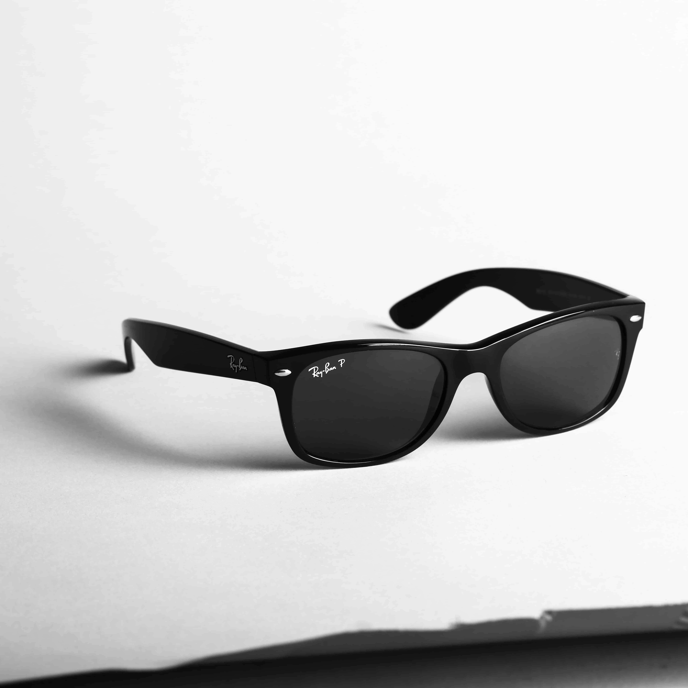
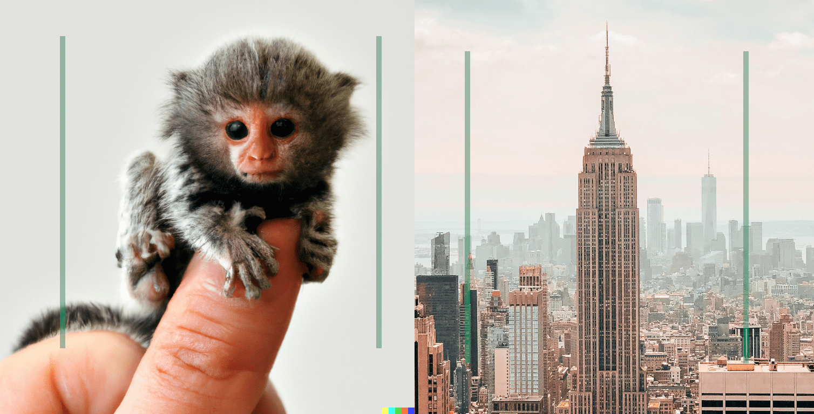

import {imgDescStyle} from "../../styles/miscellaneousInline";

# Chapter I - Field of View

Imagine that you were to put on a pair of really cool contact lenses, like the Ray-Ban of contacts.

<em>This cool, only, you know, contacts. &nbsp; </em> [A2](/image-sources)

But these contact lenses are not just fashion, they also have a special property, in that they project onto each one of your eyes two transparent, vertical, parallel lines at some distance away from each other.

So, in essence, the world through your eyes would look like this:

<em>You overlooking a concert [[A3]](/image-sources), you getting ready to binge watch Netflix [[A4]](/image-sources), you having a dream of your dorm room being super tidy [[A5]](/image-sources). </em>

Now, using those two vertical lines you would be able to match the perceived size of any pair of objects. For example, imagine that you get close enough to your finger so that it’s about the size in the picture below (ignore the little finger monkey), and then close enough to the empire state building so that it’s the same distance from the two parallel lines. In doing so, you have just matched the perceived size of your finger and the empire state building. That is, whereas in reality they have different absolute sizes, and whereas you are consciously aware of the difference in those absolute sizes, your visual perception of the two objects are matched.

<em>You can’t ignore the little finger monkey, can you? &nbsp;</em>[[A6] [A7]](/image-sources)