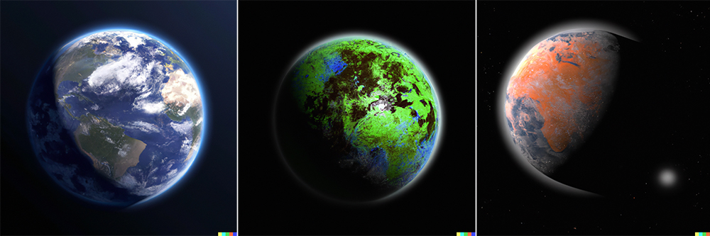

import {imgDescStyle} from "../../styles/miscellaneousInline";

# Chapter IV - Does Human Society Reproduce?

Think about your grandparents. Your grandma, who always feeds you lots of stuff when you reluctantly go to see them. Your grandpa, who always watches TV. Your other grandma, who loves to go shopping. Your other grandpa, who's a TV celebrity and enjoys waterskiing and paragliding while carrying his pet dog, Rufus.

<em>You go grandpa, be a role model for all them young kids. [A17](/fullbook/image-sources#chapter-iv---does-human-society-reproduce)</em>

What does it mean to say that they are your grandparents? Well, I don’t want to put the image of your grandfather and your grandmother having sex in your head, but that’s exactly what they did to conceive one of your parents nine months later.

And then what does it mean to say that your parents are your parents? Are you thinking of them having sex? Don’t, that’s just disgusting, come on! But that’s exactly what they did to have you.

How about your grandparents? Well, here come your greatgrandparents, naked, and…You get the gist of it. Now that we’ve imagined your closest forebears fornicating, let’s go up the lineage…where do we stop? How many generations do we have to go back for our imagined view of our ancestors fornicating to not hold up to reality? For there to have been just one entity procreating itself? We don’t know for sure, but science tells us quite a while back, possibly over a million years ago. [^1] That means countless generations of your ancestors fornicating, all leading to little Timmy.

Who is little Timmy, you ask? Why, he is your baby boy, who you’re looking at for the very first time, as you and your partner are sitting in the maternity ward of the hospital. Timmy, born of your cells, but not your cells. Timmy, who just spitted some goo on your shirt as you’re holding him, but that’s ok because he’s your son, and nothing he does is really disgusting.

<em>Aww that's so cute! Do it on the other side too! [A18](/fullbook/image-sources#chapter-iv---does-human-society-reproduce)</em>

And as you’re holding Timmy, whose skin tone makes you wonder, the nurse walks in with another baby, apologizes and says that there’s been a mix-up, and that that’s not really your son. That’s actually Francesca, and her parents are eagerly waiting to hold her in the next room. “Here is little Timmy!” the nurse adds in adorable baby talk as if it’s no big bu-bu, gently picking up Francesca and then placing Timmy in your lap with a dexterity that makes you almost unaware of the switch…And then you realize that you have some random kid’s goo on your shirt.

One of the hallmarks of an organism is its ability to reproduce - from mollusks to algae to humans, every organism does it. #freelove. Some do it asexually, like hydras, which means that the offspring only has one parent. And some do it sexually, which I’m sure you know what it means, since it’s all everyone of us people can talk about.

So, what about human society, seeing as we’ve defined it as a multizoa organism. Can human society reproduce, and if so, what would that look like?
Why yes it can, and its reproduction would mean the colonization of other planets. To understand why, let’s imagine that human society would establish a colony on Mars. And I mean imagine a somewhat realistic scenario, not a movie-like one, where the spaceship gets from point A to point B faster than I can go to the toilet.

Using the latest feasible technology imagined, it would currently take approximately 7 months for a manned trip from Earth to Mars. Also, communication between Earth and the Mars colony would be limited - it would take 20 minutes for a webpage stored on Earth to load on a computer located on Mars, as the speed of information transmission would be limited by the old speed of light (Think about THAT the next time you want to complain about your internet being slow), or for someone on the phone on Earth to hear what you said and reply.

In other words, the human society on Earth and the colony on Mars might have some communication and transfer of people and goods going between them, but their populations would by and large be separated by large distances and would be developing independently - and we all know what happens when populations of people are separated and are allowed to grow independently - they develop different customs, different ideas, different languages, different architecture, different style of clothing. (Martian fashion, anyone?) In fact, looking at the two places from space, from the alien baby perspective, so distant from each other and so different, the colony on Mars and our human society would be seen as two different multizoa organisms, with one born from the other by way of asexual reproduction. Aww, our society’s baby! I can just about imagine when the martian colony becomes a teenager, with an emo architecture, and all of those hormones are raging through her, and how our human society will not understand her because ours will be a past generation, but we’ll nevertheless learn so much about ourselves by looking at the universe through her eyes. We’ll get to multizoa hormones in a later chapter.
And if Earth then establishes yet another colony on another planet, that colony will likely come to be unique in comparison to Earth and Mars as well, and for the same reasons: It will be separated by large distances from the two societies, and its people will be allowed to grow independently. So, like having two children that can be completely different from each other - one’s tall, one’s short, one likes chocolate, the other likes to secretly wear mommy’s clothes - so too will two colonies established by Earth on two different planets grow differently, and will likely look different as well.

<em>Three different multizoa organisms rooted in their planets, with the middle and right one born asexually through our human society’s reproduction. [A19, A20, A21](/fullbook/image-sources#chapter-iv---does-human-society-reproduce)</em>

###### Footnotes

[^1]: Butterfield, N. J. (2000). Bangiomorpha pubescens n. gen., n. sp.: implications for the evolution of sex, multicellularity, and the Mesoproterozoic/Neoproterozoic radiation of eukaryotes. Paleobiology, 26(3):386-404.