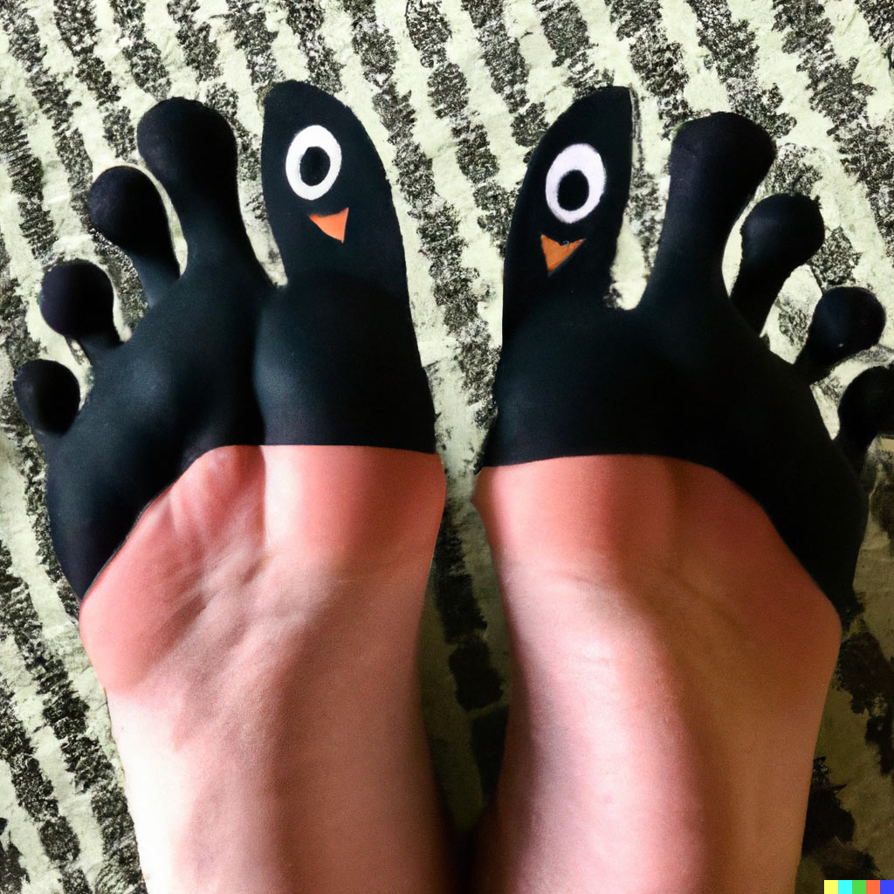
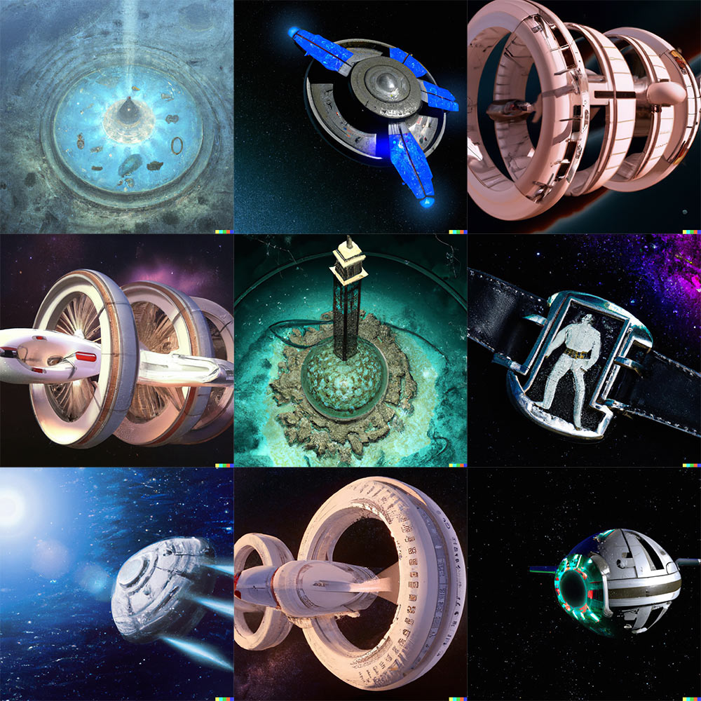
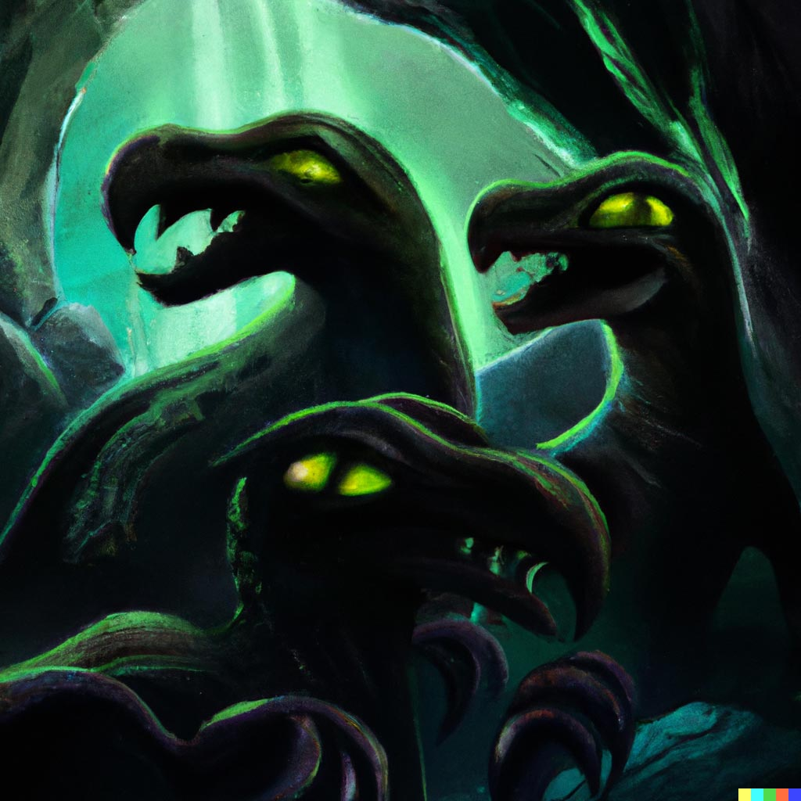
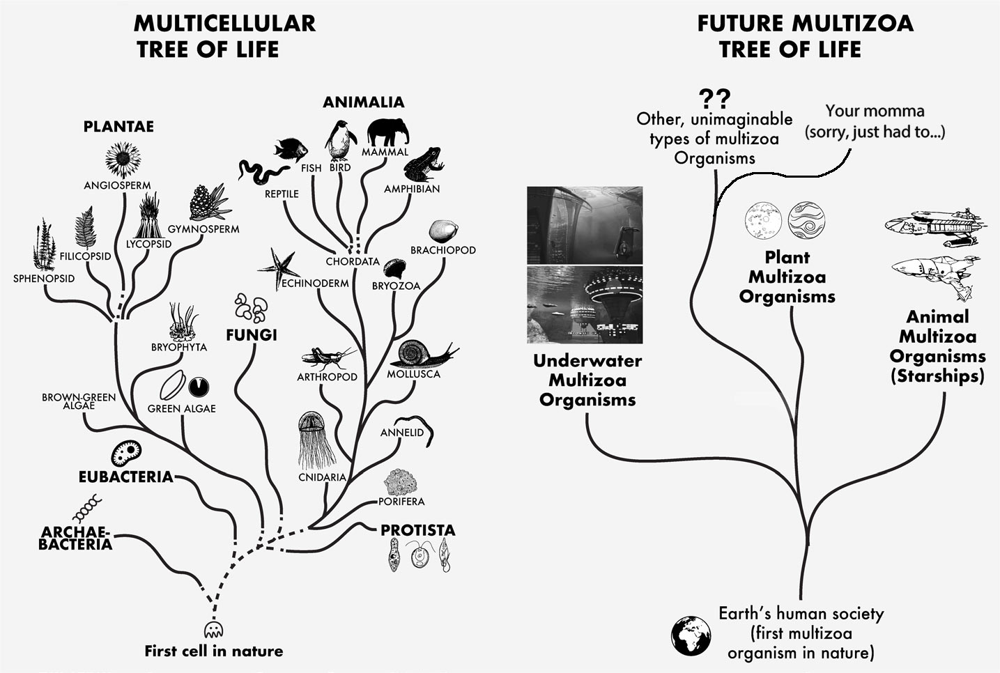
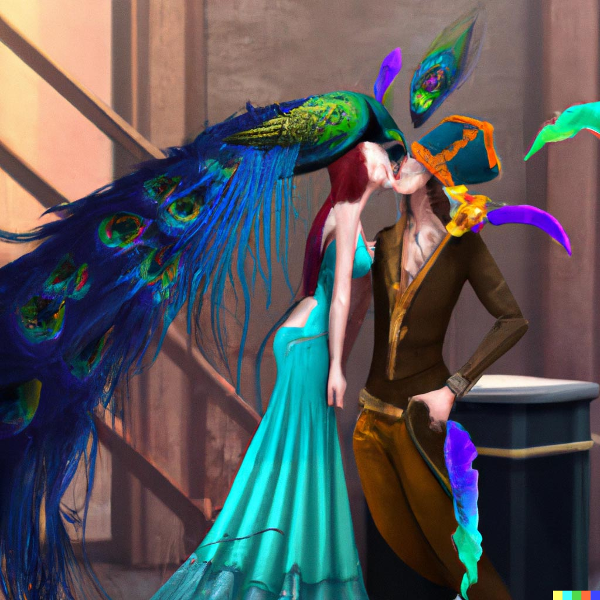

import {imgDescStyle} from "../../styles/miscellaneousInline";

# Chapter V – Do Human Societies Evolve?

So then, what about evolution? We’ve ticked off how human society can be considered a multizoa organism - an organism comprised of many animals. We’ve analyzed its feeding habits, pinning down fossil fuels as its number one feeding preference. We’ve touched on how it can reproduce - by colonizing other planets and thus having emo multizoa offpring. However, another basic characteristic of organisms is their ability to evolve over generations. Would multizoa organisms like human society evolve from one generation to the next?

It doesn’t take the brilliant mind of Dr. Who to suspect that they do. For example, the human society on Mars would inherit from the very beginning the technological developments that took thousands of years for Earth’s human society to develop: Writing, electricity, mechanical transportation, the toilet, IT, not to mention the treasure trove of ideas that lurks beneath the surface of our society, and would be able to build on their foundation from the very beginning. What would that mean for the way Mars’ cities will be built, for their means of transport, for the way that the people of this organism will come to make decisions together, for the kind of energy source this organism will extract from its surroundings (hint hint to the subject of the last chapter)? The Mars colony will definitely get a jumpstart to its beginnings that Earth’s society never had, and will have the opportunity to become much more developed than its parent organism as a consequence. Which is fine, because every parent wants to see their child go farther than they did, except when they’re brats.

Now imagine that human society were to suddenly reproduce on a hundred different planets, meaning each one would be a different colony. Of course, this is people we’re talking about, so each colony would be different, depending on the kind of planet that they reproduce on, the people that would establish it, the blueprint that the people who would be establishing it would be drawing their design from, on what kind of music everyone there would be into, and so on. And it’s easy to imagine that even though all of these societies would be established with the best of intentions by the people in them, some of these colonies would emerge as especially promising, better able to survive in their environments and to establish colonies themselves after a period of “growing up”. In other words, these promising multizoa organisms would be “naturally selected” to perpetuate their kind, and establish colonies of their own that build upon that way of being. Now I’m sure you’ve heard of natural selection before, and I don’t mean naturally selecting that chocolate fudge cake at the store…

<em>I naturally select you, chocolate mousse slice. [A22](/fullbook/image-sources#chapter-v---do-human-societies-evolve)</em>

Evolutionary theory basically describes natural selection as the more successful survival and reproduction of some organisms in comparison to others due to their particular traits, and holds it as one of the main mechanisms which shape the evolution of different species in nature. The little example just mentioned points to the fact that natural selection applies to multizoa organisms as much as it does to multicellular ones, which is good because having evolution without natural selection is like having toes without toenails...it just wouldn't feel right.

<em>Feet without toenails look really weird, am I right? [A23](/fullbook/image-sources#chapter-v---do-human-societies-evolve)</em>

Now I know what you’re thinking: “Why should I care that multizoa organisms can evolve?” Well, because if multizoa organisms evolve through the process of natural selection just like we know life on Earth has, then just imagine how the universe will look like a few hundred billion years from the time Earth established its first colony on Mars, after multizoa life had the chance to cycle through a few generations. What we might find is that this wouldn’t be Kansas anymore, because multizoa life would mushroom into a dazzling display of different shapes and sizes as it would extend farther and farther. We wouldn’t just have multizoa plants rooted on the surface of planets like our human society is, we would also have multizoa organisms evolved into huge starships capable of carrying millions of people through the cosmos - and these would be the equivalent of multizoa animals. There would probably be mulitzoa organisms living underwater on some planets as well - multizoa marine life. In other words, if multizoa organisms evolve through the process of natural selection, then given time and multizoa reproduction the cosmos would come to be brimming with life, with multizoa plants and animals of various kinds, adapted to various kinds of environments - and that’s what multizoa organisms hold the promise of being able to achieve: breathe life into the silent cosmos, like cellular life breathed life into our planet.

<em>A picture that displays a fraction of the multizoa variability that would be around after a few million years of multizoa organisms reproducing. Apparently, there’s one species of multizoa organisms that is shaped like Elvis Presley’s belt buckle (middle right image) which points to just how diverse multizoa life can become, and also proves that the King of Rock’n’Roll will never die! [A24](/fullbook/image-sources#chapter-v---do-human-societies-evolve)</em>

Not only that, but you could also trace all of this diverse multizoa life back to a common root, a common ancestor that gave rise to all of the diverse multizoa species. Care to take a guess who that would be? Exactly, our human society! Well, it would really be the lizard people, but we can’t talk about that because *they’re watching*, so yeah, \*cough\* human society!

<em>Definitely the lizard people, but shh! It’ll be our little secret.</em>

Why would human society be the common root? Because, as I’m sure you know, human society has no parent. It is the first multizoa organism of its kind, born on Earth from Earth, unlike any of the multizoa organisms that you would notice around in the future universe, because each one would have a parent multizoa organism that it would be able to blame for stuff, and if they went back far enough, all of them would trace their lineage to our Earth’s original society.

So all this multizoa life that your baby alien eyes would see throughout the future universe, it would all trace its roots back to our human society, to the moment when she learned to reproduce on Mars, and possibly repeated that process with other planets, which they in turn reproduced and so on. We’d be the seed that started it all, and over time, the process of multizoa evolution together with natural selection would lead to there being so much variation in multizoa life everywhere, with so many multizoa species, of so many types. Isn’t that beautiful?

<em>On the left you have the typical tree of life that you got in your biology textbooks. Life started with the first cell in nature that learned how to reproduce, and through the process of evolution and natural selection that took place over countless generations and reproduction cycles, it gave rise to all of the diversity in life we see today on Earth. On the right you have a similar kind of tree of life, but for multizoa organisms. And if it looks drawn by an artistically challenged 3 year old, it’s because I drew it. Anyway, as you can see, it depicts how multizoa life started with our human society, and here too, multizoa life begins to branch out due to the process of evolution and natural selection working its magic.</em>

But let’s drop the biology terms for a second, and be practical. Who would be behind all of these new types of societies, the drivers behind multizoa “evolution”? Who would come up with all the technological innovations, the brilliant ideas, the design marvels needed to give rise to these worlds? That’s right, the lizard people. But lizard people are part of a larger category of beings: People. People would be the ones to draw up the different types of starship designs, just like people would be the ones to create the technological innovations needed to take humans on Mars in the first place. It’s all people.

So, let’s imagine that you’re back next to the watercooler, in your pirate suit, when Pickle Rick starts talking about how human life is insignificant, that we’re just a small speck of life living on a speck of dust in the infinity of the universe. You shout out an excuse and ask Pickle Rick to repeat what was said, as you couldn’t hear it. In fact, you were distracted while your pirate hook and the peacock’s wing were playing around behind the watercooler. Pickle Rick repeats the whole humans are insignificant thing, and you’d be able to respond: “Humans are not insignificant at all. In fact, if human society were to learn how to reproduce on other planets, it could kickstart a process of evolution for multizoa organisms that would fill the entire known universe with life, just like the primordial cell that first learned to reproduce billions of years ago ended up filling Earth with life. And that cell didn’t get there by being all down about itself, did it?” At which point the peacock wouldn’t be able to contain itself any longer and would lean over to kiss you, hitting your unpatched eye with its beak and making you effectively blind before fusing lips.

