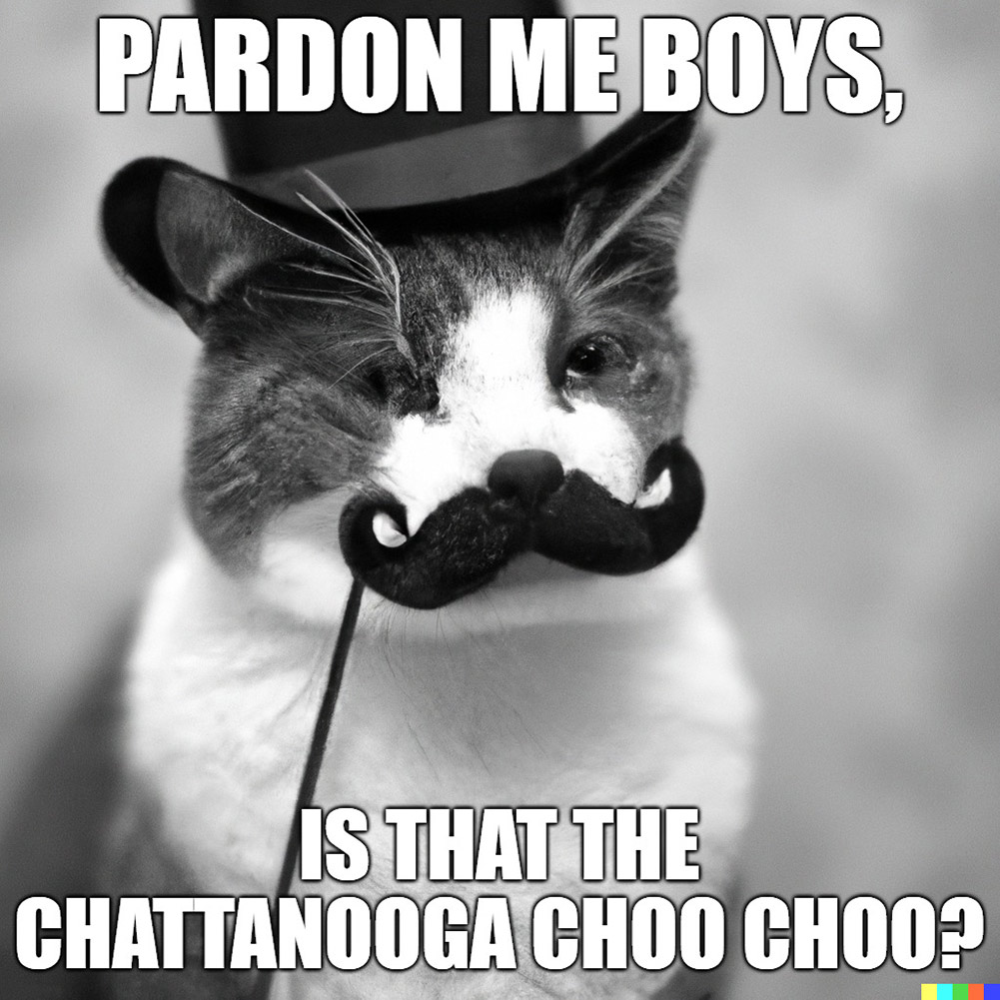

import {imgDescStyle} from "../../styles/miscellaneousInline";

# Chapter VI – Does Human Society Think?

Think of your favorite movie, like Star Wars, or Titanic, or Attack of the Killer Refrigerator. How did that movie get made? Well, there were many teams of people who had a hand in making it, like any feature film: The camera crews, the make-up artists, the various people that were filmed, the production team, the special effects team, the post-production team, the script writers, the extras, and so on. This is similar to the way in which each one of your conscious thoughts is made from the cooperation of many teams of brain cells found throughout your brain - That is, unless all of those drugs and drinking left one brain cell doing all the work, frantically moving around inside your head like some of us before our Uni assignment deadline. Anyway, language for example is made when teams of neurons from Brocca’s area, Wernicke’s area and other areas of the brain cooperate with one another.4 This is true not just of speech, but of vision, hearing, and cognition in general - every aspect of human thinking requires the cooperation of many brain cells to be made, just like works of art that become popular within human society can take the cooperation of many people to be made, whether we’re talking about movies, songs, video games.

<em>A lot of people on set were eaten during the making of Attack of the Killer Refrigerator, but it was all worth it. [A22](/fullbook/image-sources#chapter-v---do-human-societies-evolve)</em>

Then think of the effect a very popular movie like Star Wars has throughout human society: It leads to fan art, and talk-shows about it, and sequels, and movies that are similar in type, and songs, and books, and vlog posts about it which live on the weird side of the internet. And some of these things can end up becoming as popular as the movie, such as Star Wars sequels. This is similar to how, when you consciously think about something in your mind, you get different thoughts related to it emerging within your conscious awareness (just much faster because cells produce thoughts much faster than humans produce movies).

For example, think of these words: A crocodile dressed in a pink tutu, doing ballet. Now, as you think of them, you may find an image of a crocodile doing ballet emerging within your conscious awareness, like the one below. You may find a particular feeling of dread as you think of the ballet dancers that are standing next to the crocodile (Or of joy, if you’re weird that way). Thinking about the crocodile may even somehow lead to plan on going to the zoo, as you realize that you’ve never actually seen a live one. And all of these thoughts are made by various networks of cells in your brain in response to what you consciously focus on - neurons in the occipital lobe that specialize in vision, neurons in the amygdala that specialize in feelings, neurons in the frontal lobe that specialize in planning. Just like all the Star-Wars stuff would be made by people throughout human society in response to it being so popular, all of whom would be “specialized” in various fields: artsy fanboys making the fan art, talk show hosts making talk shows, movie teams making the sequels and similar sci-fi movies, bands making songs, writers making books, etc.

<em>Can't unsee it. [A22](/fullbook/image-sources#chapter-v---do-human-societies-evolve)</em>

All of this and other lines of evidence, some of which we’ll touch upon here, has lead to the development of the popularity theory of consciousness.

The theory simply states that an organism’s consciousness consists of the pieces of information created by an organism’s basic units that become very popular within that organism. And what’s interesting about this theory is that it applies to both the human body, as well as to human society.

So, the consciousness of human society is made up of pieces of information created by people that become very popular within our world - think works of art like books, movies, video games, viral videos, etc. A work of art is defined as anything that humans put creativity into making, and that we can share with one another worldwide, that can become popular.

And then the consciousness of a person is made up of pieces of information created by the person’s neurons that become very popular within their brain - thoughts, ideas, feelings, etc. Here, a piece of information  is defined as anything that brain cells make and that has the potential to travel throughout the nervous system to become conscious.

<em>On the left you have the kinds of works of art cells can create and become conscious within a brain- thoughts about various things. On the right you have the kinds of works of art that humans can create and raise within the consciousness of human society - books, music, video games, movies, etc. The sun above the Earth represent the compilations of people farting that get posted on youtube. [A22](/fullbook/image-sources#chapter-v---do-human-societies-evolve)</em>

On that note, an organism’s subconscious is defined as the works of art created by an organism’s basic units that do not end up becoming popular within that organism. So, in the case of human society it’s the books, movies, video games, cat memes that do not end up attracting the attention of people around the world. In the case of the human body, it’s thoughts created by neurons that do not have the necessary qualities to be absorbed by the networks of neurons found throughout the brain.

So, to the question “Does human society think?” The answer according to this theory is “Yes, and its consciousness is made up of whatever works of art we people make popular throughout the world.” Can consciousness really be this simple to explain? Well, let’s run the theory through a few tests to find out:

Lights, Camera, Action: Many times, you need to consciously think about something before you do it, especially if you’ve never done it before, right? Like you would never randomly find yourself sitting on one leg, with the index finger of your right hand touching the tip of your nose. In order to stand in that rare position, you would first have to consciously think about it, right after the nice officer told you to do it on the side of the road. According to the popularity theory of consciousness, that thought is a piece of information created by the neurons within your brain that became very popular within your nervous system.

<em>Forget that finger on the nose crap. If I was drunk officer, would I be able to do this? (Pukes while doing a handstand) [A22](/fullbook/image-sources#chapter-v---do-human-societies-evolve)</em>

So what about human society? Say in 10 years from now, on the 16th of February 2028, every human being on the planet - man, woman and child would be gathering in Chattanooga, Tennessee. And if you think that’s impossible because there’s just too many of us to fit, well, apparently if all human beings would be gathered together to stand shoulder to shoulder, we would occupy about the space of LA, so it’s doable.

<em>Forget that finger on the nose crap. If I was drunk officer, would I be able to do this? (Pukes while doing a handstand) [A22](/fullbook/image-sources#chapter-v---do-human-societies-evolve)</em>