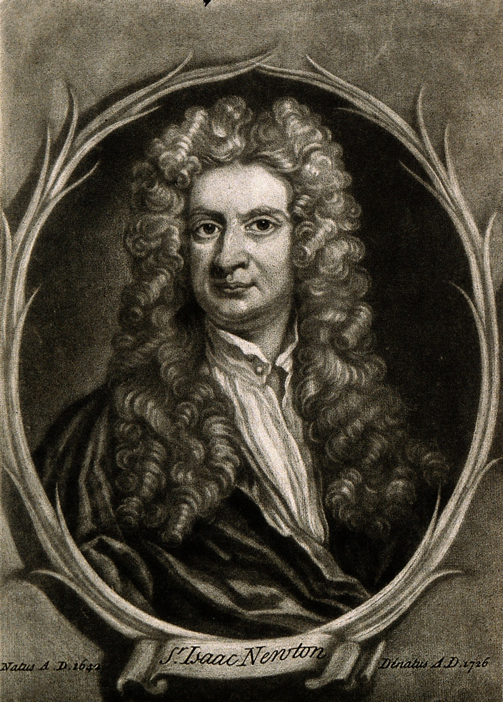

import ImageDescription from "../../components/ImageDescription";
import {imgDescStyle} from "../../styles/miscellaneousInline";

# Introduction

Before the 17th and 18th centuries, scientists were called natural philosophers. And that wasn’t taken to mean philosophers who didn’t wear any make-up and just went with a natural look. In fact, have you seen the wigs that some of these people were wearing? Ain’t nothing natural about that.

<em>Sir Isaac Newton may have been a natural philosopher, but not a natural beauty judging by that wig. &nbsp; </em> [A1 A2](/image-sources)