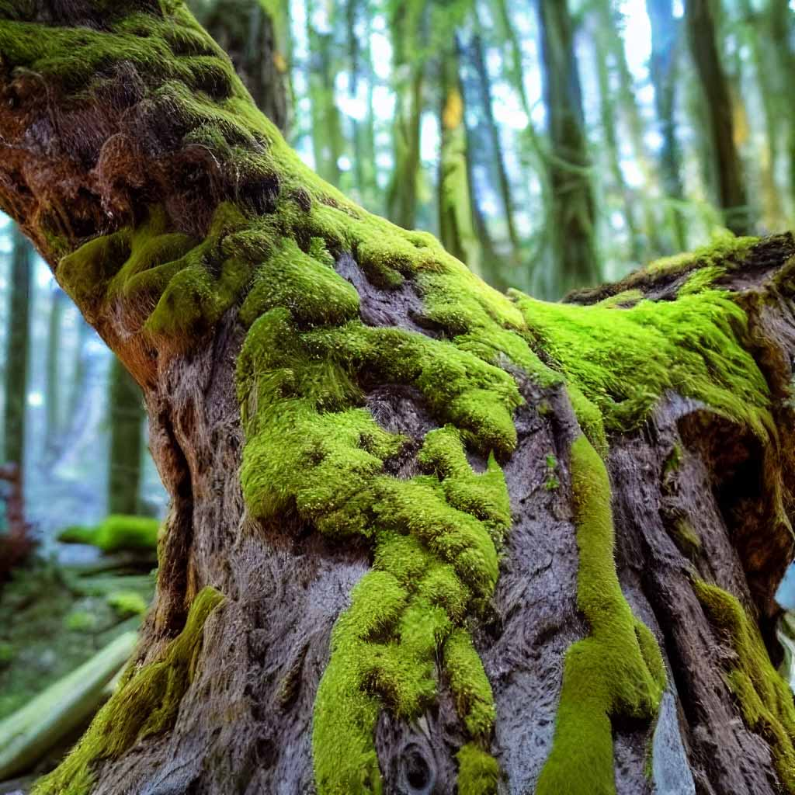

import {imgDescStyle} from "../styles/miscellaneousInline";
import {EarthImage} from "../components/EarthImage";

{
// wrapped with {} to mark it as javascript so mdx will not put it under a p tag
}
{<h1 className="text-center font-extrabold md:text-5xl mt-8">Multizoa</h1>}

## What is a multizoa organism?

<h3 style={{textAlign: "center", marginBottom: "20px"}}>THIS</h3>

[//]: # (<video width="100%" height="100%" autoPlay muted loop>)

[//]: # (  <source src="videos/landing-page/earth.mp4" type="video/mp4" />)

[//]: # (  Your browser does not support the video tag.)

[//]: # (</video>)

<EarthImage>
    

</EarthImage>

No, not the planet - the little pockmarks of light that you see growing on it. Our cities. Our towns. Our villages. Our farms. Our factories. Our roads. Our bridges. Our power lines. Our pipelines. Our railroads. Our airports. Our ports. Our schools. Our hospitals. Our homes. Our businesses. Us.

Simply put, a multizoa organism [^1] is an organism whose fundamental structural and functional unit is the human. This is similar to how the fundamental structural and functional unit of a multicellular organism is the cell. What this means is that human society is a multizoa organism growing on the surface of Earth, kind of like moss is a multicellular organism growing on the surface of a tree.

<em>Moss on tree is a multicellular organism, just like human society on Earth above is a multizoa organism. Also, is this moss in the shape of Italy in the middle?</em>

And just like a multicellular organisms, a multizoa organism like our human society breathes, feeds and can reproduce, and can do so much more.

This website discusses the view of our worldwide human society as a multizoa organism, and aims to show that analyzing human society through this lens offers valuable insights into our place in the universe and our potential future as a species.

## Find out more

**The website is still under construction. Please come up for regular updates.**

To get more information on the theory, this website will aim to provide the following resources:

* The video Is Human Society an Organism Made of Many Animals. - **NOT YET AVAILABLE**
* The book [Understanding our Whole, redefining our understanding of human society](/fullbook/front-cover). **(60 PERCENT COMPLETE)**
* The paper Is Human Society an Organism Made Of Many Animals. **NOT YET AVAILABLE**

All of it is provided for free, and with a Creative Commons license.

The website is still under construction, and not all the content is available yet. Please check back regularly to see updates. We are currently in the midst of uploading the book.

[//]: # (## Community)

[//]: # ()
[//]: # (The website also provides the ability to comment on each page, where applicable. Feel free to write your opinion, but please be respectful when doing so.)

#### Footnotes

[^1]: Etymologically, multizoa means many animals (Zoia is the Greek term for animal)

