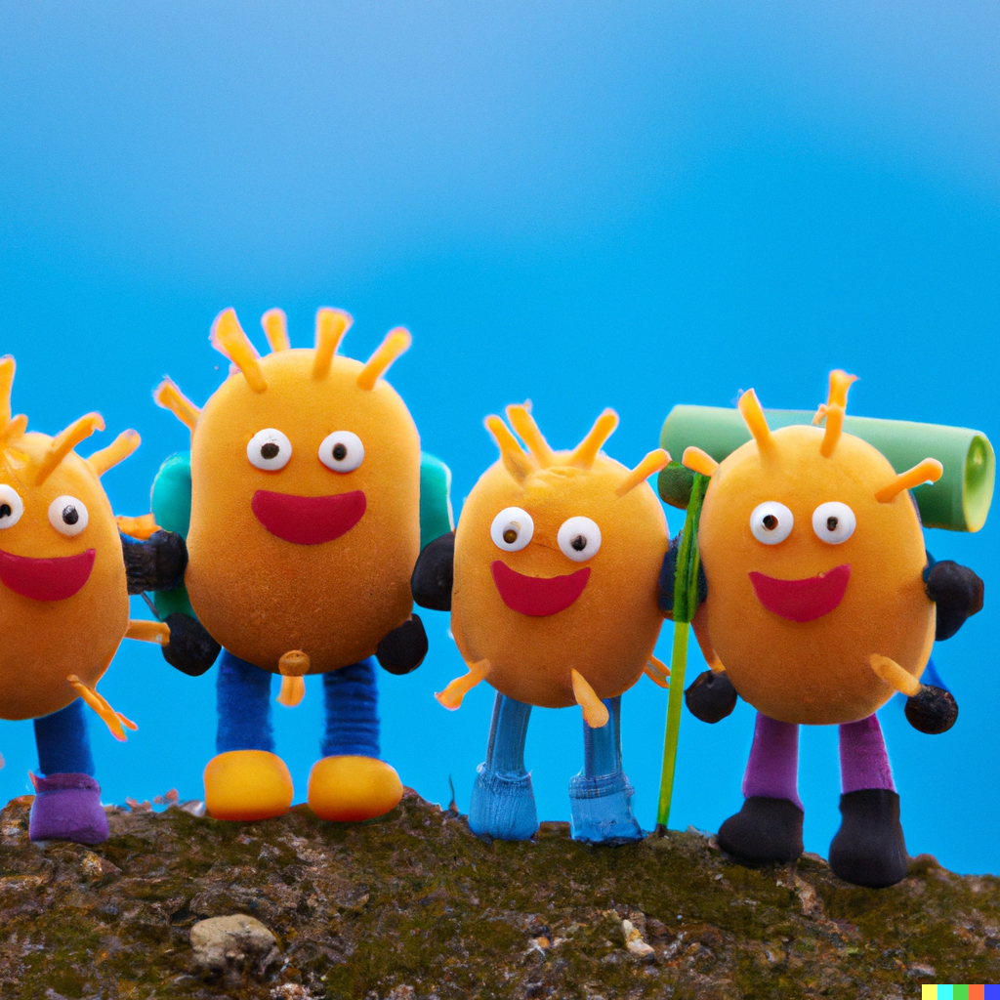

import {imgDescStyle} from "../../styles/miscellaneousInline";
import Image from "next/image";

# Chapter I - Field of View

Imagine that you were to put on a pair of really cool contact lenses, like the Ray-Ban of contacts.

<em>This cool, only, you know, contacts. [I-1](/understanding-our-whole/image-sources#chapter-1---field-of-view)</em>

But these contact lenses are not just fashion, they also have a special property, in that they project onto each one of your eyes two transparent, vertical, parallel lines at some distance away from each other.

So, in essence, the world through your eyes would look like this:

<em>You overlooking a concert [I-2](/image-sources), you getting ready to binge watch Netflix [I-3](/image-sources), you having a dream of your dorm room being super tidy [I-5](/understanding-our-whole/image-sources#chapter-1---field-of-view). </em>

Now, using those two vertical lines you would be able to match the perceived size of any pair of objects. For example, imagine that you get close enough to your finger so that it’s about the size in the picture below (ignore the little finger monkey), and then close enough to the empire state building so that it’s the same distance from the two parallel lines. In doing so, you have just matched the perceived size of your finger and the empire state building. That is, whereas in reality they have different absolute sizes, and whereas you are consciously aware of the difference in those absolute sizes, your visual perception of the two objects are matched.

<em>You can’t ignore the little finger monkey, can you? [I-6 I-7](/understanding-our-whole/image-sources#chapter-1---field-of-view)</em>

Let's make the size of objects when they are the same in relation to the two parallel lines a standard, and call it the matched perceived size of an object (mps).

Now, what is the mps useful for, you might wonder, other than subtly alluding to your shorter friends that it's ok, because you can match their perceived size with tall people anytime they'll ask you to?

Well, let's take a person, like Santa Claus - because Santa is a real person, and you can’t tell me otherwise. So you are looking at Santa, who is fitting nicely between the two vertical lines of your contact lenses, and what do you see? You see one human being, one organism. But if you were to then shrink down in size enough so that you could fit a human cell between the two vertical lines of your contact lenses (a skin cell is about 30 nanometers in size, so you would have to shrink A LOT for anything that small to fit in between the vertical lines) and looked in Santa’s direction, your mind would suddenly stop perceiving Santa as a whole, as one being. Instead, you'd most likely perceive him as a world comprised of 37.5 trillion cells, which each of us are. A universe, really, immense and rich from the perspective of a cell.
 

<Image src="/images/understanding-our-whole/chapter-1/santa-and-his-sperm-cell.png" alt="A collage of images with Santa putting on a pair of shades on the left image and a microscope film of a sperm cell on the right." width={1000} height={500} />
<em>Santa on the left [A8](/image-sources), and one of Santa’s sperm cells after you were shrunk on the right [I-8](/image-sources). Don’t ask me how I got the righthand picture…Let’s just say that Santa is real kids, he really truly is real, and has his own kinky way of participating in science on the side.</em>

Still, despite the fact that you are as small as a cell now, you'd want to find a way of visually perceiving this absolutely immense Santa as one organism again rather than a collection of cells. Could you do it? Perhaps you could, by going far away from him so that he fits between the two vertical lines again. You'd have to travel quite a distance if you’re as tiny as his sperm, but theoretically, once you are far enough from Santa so that he fits between the two vertical lines as he did when you were his size, you wouldn't be able to see all of Santa’s individual cells, but you would see him as a whole, as one entity. It’s kind of like trying to see an entire city - You can’t see it in full if you are standing at its edge because it’s too big, but if you were to climb a hill next to it and then look below, you’d be far away to see the city as a whole, and the same principle applies if you were as small as a cell but would be far away from Santa: you’d recognize Santa once more.

<em>(Plush toy cells wearing backpacks) - C’mon guys, pack your stuff. We gotta help this guy get far enough from Santa so that the kinky old man looks like one human being again, rather than a collection of cells. It’s for science! [I-9](/understanding-our-whole/image-sources#chapter-1---field-of-view)</em>

And that's one of the things that the mps is useful for. When it comes to things made from multiple distinct parts, like a human body, it helps to match the visual perception of it no matter the perceiver’s change in size by adjusting distance. Which brings us to the reason why I'm writing about mps in the first place.
So let’s revert to your original size. You're back to looking at Santa, who's also back to being about as big as you, sitting in between the two vertical lines of the contact lenses (See picture of Santa from previously, next to picture of Santa’s sperm). Then you go board a rocket, and fly it outside of Earth's atmosphere. While enjoying a spliff and realizing that you might trip off the smoke alarm because of it, you turn around and look at Earth, and you put Earth in between the two vertical lines of your contact lenses. What do you see?

<em>Earth from space [I-10](/understanding-our-whole/image-sources#chapter-1---field-of-view)</em>

Well, just like it was with Santa and his cells, you're not able to perceive individual humans roaming around back down on Earth - they're way too small from your current field of view. And if that spliff made you just high enough, you'd let go of all of your preconceptions regarding what you know about what goes on on Earth, and you'd look at what you're seeing with fresh eyes, like a baby, or an alien. An alien baby. Say you're looking at the side of Earth that's in the nighttime, and you're seeing the little pockmarks of light emitted by human society's cities.

<em>Those bright lights? The bioluminescence of an organism growing on the planet’s surface.  [I-11](/understanding-our-whole/image-sources#chapter-1---field-of-view)</em>

How would interpret that view, with your alien baby eyes, sporting those really cool contact lenses?

Well, just like it was when you had Santa in between the two vertical lines of the contact lenses, where you perceived him as one being rather than a collection of cells, here too you may conclude that rather than looking at a bunch of people that form human society, what you're looking it at is a single organism growing on the surface of Earth. One entity rather than a collection of human beings, it is a bioluminescent organism, in that it can emit light during the nighttime. That’s what you’re seeing in that picture.

