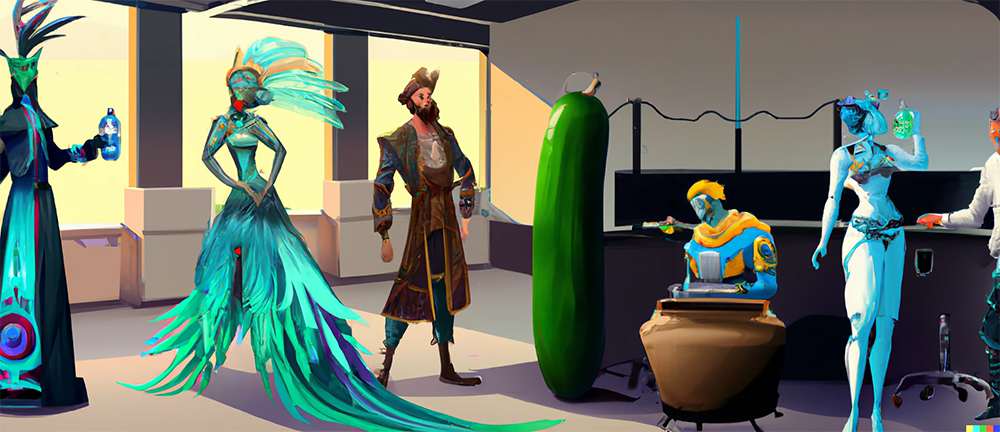

import {imgDescStyle} from "../../styles/miscellaneousInline";

# Chapter II - What Kind of Organism is Human Society?

A human body is an organism comprised of many cells, we've already established that in this book at least, if not in your biology classes - especially not if you were too busy sending off texts to your bestie back then, like I was.

In other words, a human body is a multicellular organism. Multi means many, and cellular means rice pudding in old Gaelic. No it doesn't, I’m just messing with you, it means related to cells. So, multicellular -> many cells.

All animals and plants are multicellular organisms. There, we just summarized about half of all useful things that you would have learned in your high school biology classes. The other half will come in the next chapter.

So, what kind of organism is human society then? Well, it would not be terribly useful to define human society by the fact that it is made up of many cells. I mean, yes, human beings are made of cells, and human society is made of human beings, so it would technically be true. But it's also technically true that chickens can fly, and we don't call them birds, do we? We call'em chickens! Or wait, are they birds? Well, anyway, the point of that analogy is that it's also technically true a human body is made up of many proteins, because proteins are the building blocks of cells, and yet we don't say that a human body is a multiprotein organism, do we? And why not? Because the basic structural and functional unit of a human body is the cell, not the protein.

So too is the structural and functional unit of human society the human being, not the cell. Do you follow?

Human body -> made up of many cells -> multicellular organism \
Human society -> made up of many people-> So then what kind of organism is human society?

Look, I'm not going to introduce many new words in your vocabulary with this book [^1], because it'd be boring for both you and me, and we shouldn't bore the people that we care about....although that would be a good test of our friendship. But if there is one thing that you take away from this book, it'd be this new word: multizoa.

Human society is a multizoa organism. Multi means many, and zoia means animal. In other words, this means that human society is an organism comprised of many animals.

Now why should you remember this word? Well, imagine that you're sitting next to a water cooler at your Uni or office. You're dressed in a pirate suit, because it's Halloween, obviously (you really wanted to go as the wolf from little red riding hood, but there were no more wolf costumes) when a peacock, the robot from The Day the Earth Stood Still and Pickle Rick that are sitting around you strike up a conversation about the state of the world.

<em>Watercooler Talk</em>

It is then that you could say *"Hey, do you know that human society is an organism? Yeah, it's a multizoa organism, which means an organism comprised of many animals."*

Everyone would look at you with admiration, including the person in the peacock costume whom you've had a crush on for months but now you're second guessing your feelings because why the hell would they have chosen to wear that ridiculous peacock costume, am I right? That's why!

Now that we've determined what kind of organism human society is, what can we say about it?

P.S. Dammit! I just checked and chickens are birds. There goes my analogy. Starting to think analogies are not my strong point.

###### Footnotes

[^1]: Well, maybe one more word: Gazump -> the sound two hippos make when mating.