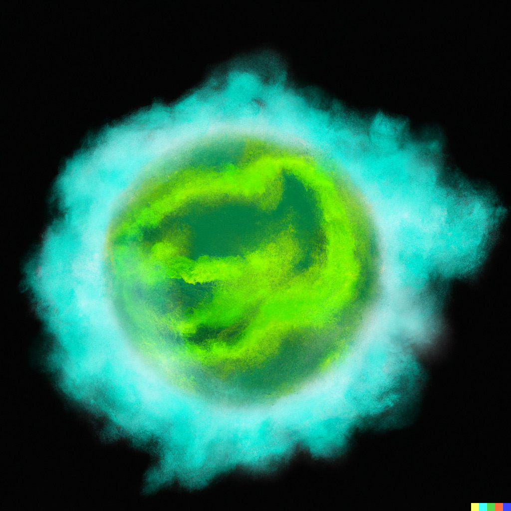
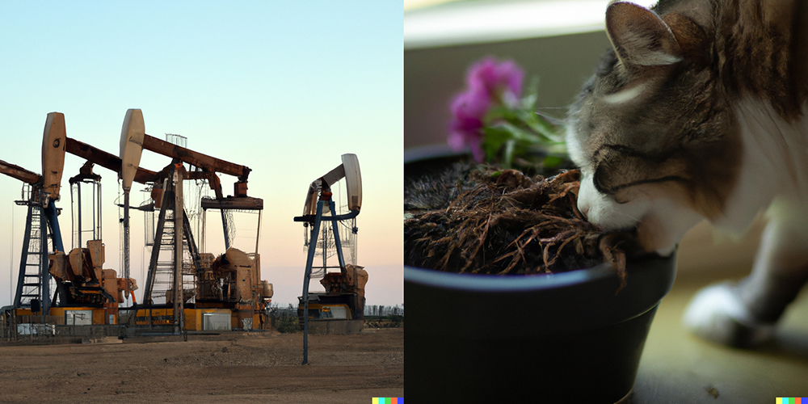

import {imgDescStyle} from "../../styles/miscellaneousInline";
import Image from "next/image";

# Chapter III - Does Human Society Feed?

You’re on your roof one day, putting up your brand spanking new solar panels. You’re pretty proud of yourself while you and the other workers you’ve gotten to assist you are busy setting everything up. Here you are, saving the environment, not to mention creating energy that you can feed back into the electricity grid for a good price. Neighbors pass by from time to time, looking at you and your slightly sweaty, sexy body up on that roof on a clear sunny day, and you know what they’re thinking…They’re thinking of how it would be like to consume some energy together on those solar panels, just the two of you, while the solar panels around are busy creating some energy. Yep, that’s exactly what they’re thinking, and it’s what you were thinking about too, until Jessie, the neighbor living across the street steps out of his house and walks towards you. You roll your eyes instinctively as that inexplicably sexy image of you and an unknown neighbor getting busy on solar panels disappears into oblivion. That’s because you know what’s coming: A weird conversation. Jessie is that funky neighbor, always kind of slow and with a lazy eye to go with it. You’ve always found it hard to follow both your conversations with him, which he has a knack for making uncomfortable, as well as his eyesight with that wobbly eye of his. And that connection is the one symmetrical thing that you’ve noticed about him.

*“Watcha doing?”* you can hear him ask as he walks across the street while looking towards you up on the roof, cars honking while going around him. But that has no effect on Jessie, who continues his stroll like it’s his momma’s street.

*“I’m putting up solar panels,”* you answer, trying to make yourself busy with something around you, turning halfway away from his direction. You notice the change in your body language, and then you feel a sense of guilt bubbling up in your chest. *“Well, maybe I shouldn’t be like this towards him,”* you think. *“It’s not his fault that he’s like this. A conversation might do him some good, and it’s not that big of an effort from me, is it?”* You then turn back to where you saw him last with the thought of saying more…but he’s nowhere in sight from your vantage point on the rooftop. You don’t see him on the street anymore, and he’s not on any of the sidewalks. A sense of relief rises in your mind at the thought that he may have gone back home, but before you have the time to rationally discard that idea, you can see the tip of the ladder you and the workers used to get on top of the roof moving, and the sound of climbing footsteps. Oh no!

You rush to the ladder’s location and looking down, you see a climbing Jessie looking back at you, smiling. Well, at least you assumed he was looking at you, you can never tell with that lazy eye.

*“Jessie, I’m sorry but I don…”* before you could finish your sentence however, Jessie was already done with the ladder and was on the roof next to you.

*“Whatcha doing?”* he asked again with that childish smile on his face, as if you were not just in the middle of telling him to buzz off.

*“I told you, I’m putting up solar panels, but you ca…”*

*“Oh, that’s nice. Why?”*

You sigh, with one of those deep sighs that generals of a losing army make when they know they’ve lost. *“Might as well…”* you think to yourself. You quickly turn around to make sure the workers were fine, and they seemed to be, getting on with the job of fitting the panels, with no more than a few passing glances at Jessie as they were probably wondering what that strange boy is doing up here. They should be ok for the next minute or two without you, while you handled the situation. You turn back to Jessie, and say *“Well, because I got a good deal on these solar panels, and because it saves money in the long run…And because I’m doing my part to help the environment this way.”*

*“Oh, that’s good,”* Jessie replies while nodding hastily, *“80% of human society’s energy production comes from fossil fuels, so it is good that you are helping to diversify our energy production.”*

*“That’s nice, but Jess, you…Wait, what?”* It took a few moments for what Jessie just said to sink in. It’s hard to impress on the readers of this book how totally out of place Jessie’s remark really is. You’ve known the boy for quite a while, but as harsh as this sounds, he has never said anything remotely intelligent to you in this entire time. He has however managed to destroy your lawnmower while trying to be neighborly, to crash one of your famous Uni parties and get so wasted that he threw up in the swimming pool...while people were in it, to feed your cat prescribed pills to the point where Unicorn (that’s the cat’s name) had to go to the Vet and drooled on your carpet for the next week, and other incidences which do not necessarily point to his interest in the fossil fuel production of the world.

*“Yes, oil, natural gas and coal,”* he continues. *“According to the latest estimates, about 80% of the world’s energy comes from fossil fuels. That means energy for electricity, and to power cars, boats…everything!”* he adds with such enthusiasm in his voice, that it makes you take a step back. Jessie responds by taking a step forward…He was never very good with personal space.

It’s not that you don’t know these things – though perhaps not to these exact numbers. You know that a big chunk of the world’s energy comes from oil and coal, but to hear Jessie opening up this subject for some reason put him in a completely different light in your eyes. It’s like one of those visual illusions where you can see two very different things in the same image.

<Image src="/images/understanding-our-whole/chapter-3/freud-optical-illusion.jpg" alt="An optical illusion that shows both freud and a naked woman." width={300} height={300} layout={"fixed"} />

<em>An optical illusion that shows...well, if I explain it here it will ruin the illusion. [A13](/fullbook/image-sources#chapter-iii---does-human-society-feed)</em>

You went from seeing Jessie the numbskull to seeing Jessie the misunderstood savant. Maybe you were wrong about him all of this time, maybe he just needs help to express all of these ideas, maybe somewhere inside of him lurks a genius!

And then you begin to tilt backwards and you find that one of your feet is in the air. You realize that while you were focused on assessing Jessie’s genius status, you were also unconsciously taking steps backwards as Jessie was taking steps forwards to retrieve your personal space, until there was no roof left for you to walk on. And during your fall in the shrubs, from which it would take a good few weeks in the hospital to recover with all of them broken bones, you came to two important conclusions:

1. Human society is a multizoa organism that feeds mainly on fossil fuels.
2. You were right about Jessie all along.

Now, is the first conclusion true? Let’s visualize human society from the alien baby perspective that we had in the first chapter once more.

<em>Earth if its main energy production was reliant on farts. Would that make it a gaseous planet? We'll let the scientists decide. [A16](/fullbook/image-source#chapter-iii---does-human-society-feed)</em>

When we talk about human society being a multizoa organism, would it be more of a plant-like multizoa organism, or an animal-like multizoa organism? It looks like more of a plant-like organism, doesn’t it? I mean, it doesn’t have an animal-like body that moves around everywhere, it has a plant-like body that’s rooted on the surface of Earth. We also know that what Jess said was true: 80% of the world’s energy does come from fossil fuels – oil, natural gas and coal. So we could say that human society’s roots are those steel machines that penetrate the Earth’s crust to do what? To extract fossil fuels that amount to the large bulk of energy used by our organism – crude oil, natural gas, coal – not unlike how the roots of plants penetrate the soil to extract the essential nutrients their bodies use as energy.

<em>On the left you have oil wells – human society’s roots that dig deep into Earth’s crust to extract oil, one of the essential nutrients that human society needs for its survival. [A14](/fullbook/image-sources#chapter-iii---does-human-society-feed) And on the right you have grass roots digging deep into the pot’s soil to extract minerals that are essential for the plant’s survival. [A15](/fullbook/image-sources#chapter-iii---does-human-society-feed)</em>

So in going along with this theory, what would happen if fossil fuels were to suddenly vanish? Although there are no actual case studies on the subject, pretty much all experts on the matter agree that if all fossil fuels were to disappear from the planet, it would be a big bu-bu. The general consensus is that without them cars & other means of transportation would stop running, which among other things means that food would stop going into major cities, and people would start eating their cats. Alright, that last part is just my assumption (sorry Unicorn), but whether or not that’s true, it would still be bad. In fact, it would be bad enough that from the alien baby’s perspective, the lights coming from human society would start to slowly fade away from various parts of its body, and you could conclude that something is seriously wrong with this organism….And a closer inspection would reveal that it is going hungry.

To make it clear, my point with all of this is not to diss fossil fuels, I’ll leave that to Leonardo DiCaprio. That, and spectacular acting. Let no one say that I’m not generous. Neither is my point to extoll the beneficial properties of fossil fuels, and explain how I bathe in them everyday because it helps with my skin. No, my point with this is simply that human society is an organism that primarily feeds on fossil fuels. It is the way that this organism’s body has managed to grow from less than 1 billion people at the end of the 18th century to more than 7 billion presently. It is how the increasing energy demands of such an intensely growing population have managed to be met. It is how your grandma and my grandma and millions of other grandmas on the planet could all have the energy to watch prime time TV at the same time.

And as for whether or not things could be different…My assumption is that a multizoa organism whose primary energy source would not be fossil fuels would correlate with such major internal, structural differences from our world that it would be a different society altogether. It would have to grow into that energy consumption just as our society grew into consuming fossil fuels as its energy supply. Whether that society would be better or worse is a different subject matter, but it will be different: different transportation fuel, different energy extraction plants, different pipelines for conducting that energy. Kind of like how apples and oranges are different. Presently, our multizoa organism has, for better or worse, fed on fossil fuels to grow as big as it is today.

Now, there is a big difference between a human body going hungry and human society going hungry that’s worth mentioning, because it has to do with the next chapter. If a human body were to starve, its cells would all die together, because they are all so specialized to rely on each other that if the cells which are meant to provide food to the entire body aren’t able to fulfill their role for some reason, other cells won’t be able to say “You know what? We’re ditching this joint,” pack up their proteins in suitcases, and have a max exodus of the body in the search for greener pastures – they won’t be able to survive outside of the human body.

Some human beings however could survive without human society if there was a full meltdown due to lack of energy. Perhaps not all 7.5 billion, but quite a few humans would be able to resettle. However, that doesn’t mean that human society as we know it would have survived, for human society includes the human networks and the reoccurring human interactions within it as much as it does the individual humans themselves. In other words, although humans are the most important part of the equation, human society includes the newspaper getting printed and rolled out every morning as much as it does the person reading the paper. It includes the bread being delivered to the sandwich shop around the corner as much as it does the people who get their sandwiches from there. It includes the boat that carries lightbulbs from China as much as it does the people buying the lightbulbs. Human society is the complex interconnected system arising from human interaction as it is the humans themselves, and that interconnected system would die if human society were to “starve” due to lack of fossil energy, if not all of the humans that make up human society.

Enough talk about death now, I’m getting all teary eyed. Let’s look at the polar opposite of death – nachos – by asking: What is at the basis of this difference just mentioned between a human body and human society?