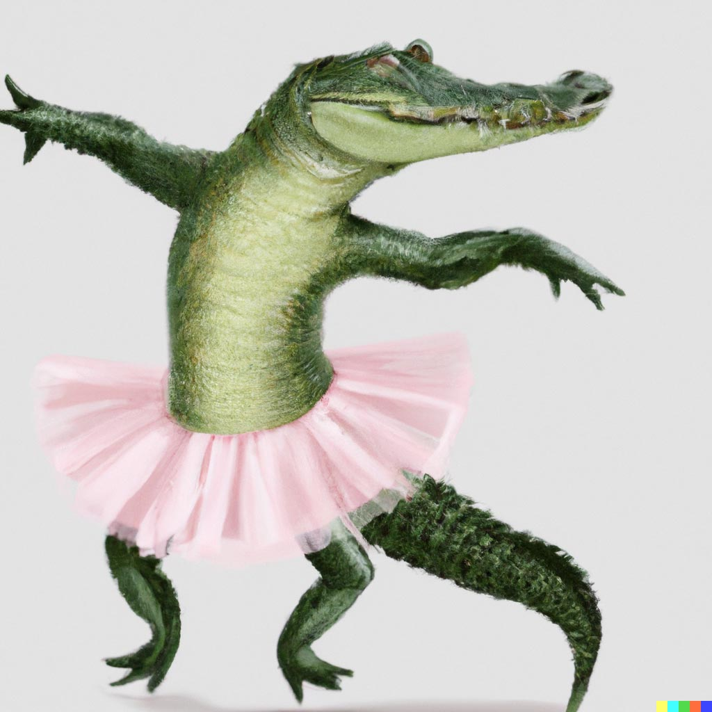
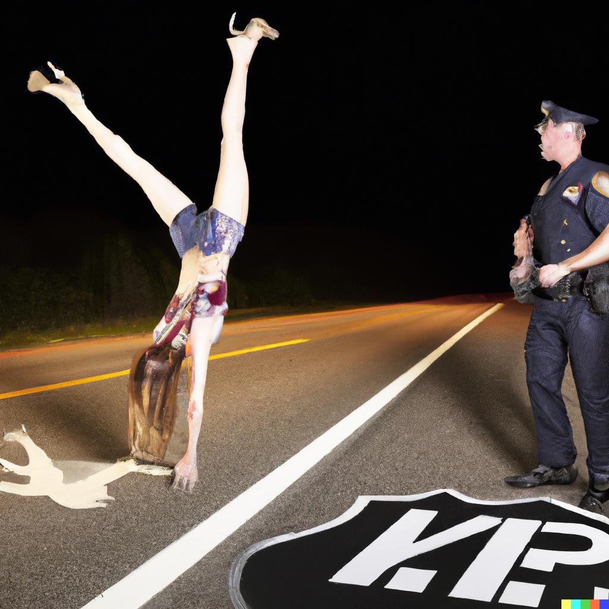
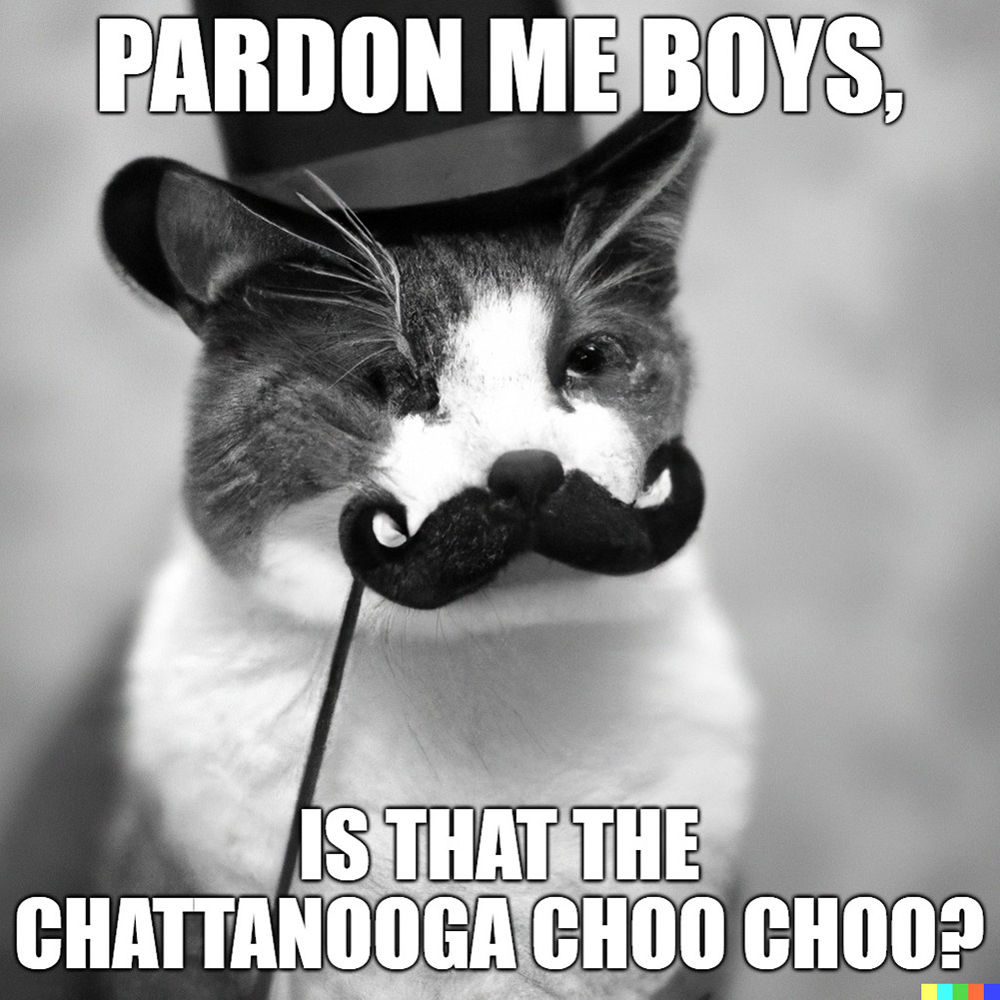

import {imgDescStyle} from "../../styles/miscellaneousInline";
import DynamicImage
    from "../../components/DynamicImage";
import PeacockPirateKiss from "../../public/images/understanding-our-whole/chapter-6/peacock-pirate-kiss.jpg";

# Chapter VI – Does Human Society Think?

Think of your favorite movie, like Star Wars, or Titanic, or Attack of the Killer Refrigerator. How did that movie get made? Well, there were many teams of people who had a hand in making it, like any feature film: The camera crews, the make-up artists, the various people that were filmed, the production team, the special effects team, the post-production team, the script writers, the extras, and so on. This is similar to the way in which each one of your conscious thoughts is made from the cooperation of many teams of brain cells found throughout your brain - That is, unless all of those drugs and drinking left one brain cell doing all the work, frantically moving around inside your head like some of us before our Uni assignment deadline. Anyway, language for example is made when teams of neurons from Brocca’s area, Wernicke’s area and other areas of the brain cooperate with one another.4 This is true not just of speech, but of vision, hearing, and cognition in general - every aspect of human thinking requires the cooperation of many brain cells to be made, just like works of art that become popular within human society can take the cooperation of many people to be made, whether we’re talking about movies, songs, video games.

<em>A lot of people on set were eaten during the making of Attack of the Killer Refrigerator, but it was all worth it. [VI-1](/understanding-our-whole/image-sources#chapter-vi---does-human-society-think)</em>

Then think of the effect a very popular movie like Star Wars has throughout human society: It leads to fan art, and talk-shows about it, and sequels, and movies that are similar in type, and songs, and books, and vlog posts about it which live on the weird side of the internet. And some of these things can end up becoming as popular as the movie, such as Star Wars sequels. This is similar to how, when you consciously think about something in your mind, you get different thoughts related to it emerging within your conscious awareness (just much faster because cells produce thoughts much faster than humans produce movies).

For example, think of these words: A crocodile dressed in a pink tutu, doing ballet. Now, as you think of them, you may find an image of a crocodile doing ballet emerging within your conscious awareness, like the one below. You may find a particular feeling of dread as you think of the ballet dancers that are standing next to the crocodile (Or of joy, if you’re weird that way). Thinking about the crocodile may even somehow lead to plan on going to the zoo, as you realize that you’ve never actually seen a live one. And all of these thoughts are made by various networks of cells in your brain in response to what you consciously focus on - neurons in the occipital lobe that specialize in vision, neurons in the amygdala that specialize in feelings, neurons in the frontal lobe that specialize in planning. Just like all the Star-Wars stuff would be made by people throughout human society in response to it being so popular, all of whom would be “specialized” in various fields: artsy fanboys making the fan art, talk show hosts making talk shows, movie teams making the sequels and similar sci-fi movies, bands making songs, writers making books, etc.

<em>Can't unsee it. [VI-2](/understanding-our-whole/image-sources#chapter-vi---does-human-society-think)</em>

All of this and other lines of evidence, some of which we’ll touch upon here, has lead to the development of the popularity theory of consciousness.

The theory simply states that an organism’s consciousness consists of the pieces of information created by an organism’s basic units that become very popular within that organism. And what’s interesting about this theory is that it applies to both the human body, as well as to human society.

So, the consciousness of human society is made up of pieces of information created by people that become very popular within our world - think works of art like books, movies, video games, viral videos, etc. A work of art is defined as anything that humans put creativity into making, and that we can share with one another worldwide, that can become popular.

And then the consciousness of a person is made up of pieces of information created by the person’s neurons that become very popular within their brain - thoughts, ideas, feelings, etc. Here, a piece of information  is defined as anything that brain cells make and that has the potential to travel throughout the nervous system to become conscious.

<em>On the left you have the kinds of works of art cells can create and become conscious within a brain- thoughts about various things. On the right you have the kinds of works of art that humans can create and raise within the consciousness of human society - books, music, video games, movies, etc. The sun above the Earth represent the compilations of people farting that get posted on youtube. [VI-3, VI-4](/understanding-our-whole/image-sources#chapter-vi---does-human-society-think)</em>

On that note, an organism’s subconscious is defined as the works of art created by an organism’s basic units that do not end up becoming popular within that organism. So, in the case of human society it’s the books, movies, video games, cat memes that do not end up attracting the attention of people around the world. In the case of the human body, it’s thoughts created by neurons that do not have the necessary qualities to be absorbed by the networks of neurons found throughout the brain.

So, to the question “Does human society think?” The answer according to this theory is “Yes, and its consciousness is made up of whatever works of art we people make popular throughout the world.” Can consciousness really be this simple to explain? Well, let’s run the theory through a few tests to find out:

Lights, Camera, Action: Many times, you need to consciously think about something before you do it, especially if you’ve never done it before, right? Like you would never randomly find yourself sitting on one leg, with the index finger of your right hand touching the tip of your nose. In order to stand in that rare position, you would first have to consciously think about it, right after the nice officer told you to do it on the side of the road. According to the popularity theory of consciousness, that thought is a piece of information created by the neurons within your brain that became very popular within your nervous system.

<em>Forget that finger on the nose crap. If I was drunk officer, would I be able to do this? (Pukes while doing a handstand) [VI-5](/understanding-our-whole/image-sources#chapter-vi---does-human-society-think)</em>

So what about human society? Say in 10 years from now, on the 16th of February 2028, every human being on the planet - man, woman and child would be gathering in Chattanooga, Tennessee. And if you think that’s impossible because there’s just too many of us to fit, well, apparently if all human beings would be gathered together to stand shoulder to shoulder, we would occupy about the space of LA, so it’s doable.

<em>Forget that finger on the nose crap. If I was drunk officer, would I be able to do this? (Pukes while doing a handstand) [VI-6](/understanding-our-whole/image-sources#chapter-vi---does-human-society-think)</em>

And looking at the Chattanooga gathering from your baby alien perspective in outer space with a pair of binoculars, you might find yourself asking: “Why did this organism’s body huddle up like that? Is it cold or something? Does it need a blankey?”

<em>We're gonna need a big pretty big blankey [VI-7](/understanding-our-whole/image-sources#chapter-vi---does-human-society-think)</em>

In other words, seeing human society as a whole would make you define the gathering as human society’s action: Human society “contracted its body”. Now, what would make this momentous gathering possible? Well, whatever the nitty-gritty of it would be, one thing’s for sure: In order for everyone to know that they should go to Chattanooga on that day, that information would have to travel throughout human society to reach each and every person on Earth. In other words, that information, created by people, would have to become extremely popular within human society before “human society’s body” would engage in the action of “contracting”. Just like your thought, created by your neurons, of you standing on one leg and touching the tip of your nose with your index finger had to become conscious within your brain before you could engage in the actual action on the side of the road. Using the popularity theory of consciousness, which allows us to translate between consciousness and popularity, these two processes correlate awfully well:

Before you could engage in the action of standing on one leg and touching the tip of your nose with your index finger on the side of the road, you had to consciously think about it. And that conscious thought was a work of art created by your neurons that become very popular within your brain.

Before human society could engage in the action of contracting its body around Chattanooga, Tennessee, it had to consciously think about bringing together all of its people into that one place. And that conscious thought (whatever contained the idea of having that happen) was a work of art created by people that became very popular within human society.

Ok, so the popularity theory of consciousness seems to check out so far, if it’s not somewhat oversimplified. In that, if everyone were to come together in Chattanooga, it wouldn’t be just because of one “work of art” created by people that became very popular within human society. There may have been one work of art that started it, but the gathering would actually happen because the idea would spread through many works of art created by people throughout the world - news articles in various languages, and social media posts, and news stories on TV in various languages, and breakfast shows talking about it right after they showcase the latest frying pan, and leaders of various groups releasing communications that urge their brethren to go, and billboards, graffiti, and so on…Not to mention that apart from works of art, it would also involve people simply talking about it, and that would be a big part of it, from friends gathered for lunch discussing it, to grandmothers calling their grandkids to talk about this crazy thing. But simplification also makes things easier to remember, so we’ll let this one slide, and leave the complicated bits for the purists. Apart from that, let’s just say that for the most part, the popularity theory of consciousness looks good for now, but still needs more evidence.

And since we don’t have all day, let’s run the TK theory through a harder test, a make-it or break-it kind of thing, and move on if it checks out.

That test is the “I”. Whenever you think stuff like “I am eating" or “I had a wet nightmare” do you ever wonder about the “I” part? We use it all the time: I do this, I think that, I like that, I went there, I am ticklish there, I petted a goat. It’s a pretty important side of our thinking and action, and yet, there’s no real common knowledge understanding of how the “I” comes to exist, other than, you know, it being the soul. So how does the popularity theory of consciousness handle it? Well, according to it, the “I” in each one of your conscious thoughts is part of a work of art created by cells that became very popular within your brain, because whatever you’re thinking, whether it’s “I am eating” or “I had a wet nightmare”, it’s just one such work of art created by your neurons.

<em>My wet nightmare - drowning in a sea with my laptop. Well what did you think it was? [VI-8](/understanding-our-whole/image-sources#chapter-vi---does-human-society-think)</em>

And if the popularity theory of consciousness is true, then human society can have a similar thing to the “I” too. So let’s run an experiment: Meet the Y. The “Y” is for human society what the “I” is for the human being. In other words, Y am human society, just like I am a human being. mY body consists of human beings throughout human society, just like my body consists of my cells. Y eat fossil fuels, just like I eat nachos. Y am rooted on the surface of Earth, just like I have no roots, yo. Hello, mY dear humans!

Now, according to the popularity theory of consciousness, if statements that include the “Y” become popular throughout human society then human society will become conscious of them, just like if thoughts that include the “I” become popular throughout your brain you will become conscious of them. Otherwise, they’d be unconscious. And are the effects similar when they do become conscious?

Say that rather than just any old idea of bringing people together, the statement “Y am gathering all of mY human beings together around Chattanooga, Tennessee on the 16th of February 2028” becomes popular throughout human society. Like we’ve said before, it gets broadcasted through news stations, and breakfast shows, and vlog posts, and people tattoo it on their buttocks, and so on. According to the popularity theory, it becoming so popular is just another way of saying that human society becomes conscious of it, and vice versa. And if all of us do gather together in Chattanooga in 2028 as a consequence of the statement becoming conscious, i.e. popular, then according to the popularity theory of consciousness, we can phrase it this way:

- Human society consciously thought of bringing all of its people together in and around Chattanooga, Tennessee.
- As a consequence, human society acted and brought its body together in and around Chattanooga, just like it thought of doing.

This is similar to what happened when you were on the side of the road, next to the nice officer:
- You consciously thought of standing on one leg and placing your right index finger on the tip of your nose.
- Your body engaged in that action as a consequence of that thought, and although you wobbled you didn’t fall, because you weren’t THAT wasted. #win

So it seems that the “Y” brings us one step closer to a complete overlap between what happens when a human being thinks & acts and what happens when human society & acts.

However, you may still not be totally convinced about the TK’s explanation of how the “I” comes about, and would like to point out that although you see some logic behind it, the “I” and the “Y” are unlike each other in this way and that, citing one of their numerous differences. But remember: Human society is the first multizoa organism in existence that we know of, whereas your body is the result of multicellular organisms reproducing and evolving over millions of years and countless generations. Who knows how evolved the sense of “Y” will come to be for multizoa organisms that are the result of countless multizoa generations reproducing, how that animal-like multizoa organism living billions of years from now, born from our society’s colonies will come to understand Ytself? But what we can glimpse at through our example is that the seed for such an understanding is there within our society, and, well, we have to start somewhere. We’ve started with the Y.

Before we move on, I’d like to mention one thing about this subject, just because I think it’s so freaking cool: According to the TK theory, if the statement “Y am a multizoa organism that can think and act, and plan, and mY conscious thoughts are the works of art created by the people within mY Body that become very popular,” were to travel throughout human society and itself become as popular as, say, Coke, then human society will essentially become self-aware. How amazing is that? We know that self-awareness is a fundamental aspect of any sentient being that can make pancakes, so we’ll be coming back to this topic in the next chapter.

Now, one of the important aspects of an organism’s consciousness is the beneficial effects of its focus. We people are innately aware of it when it comes to ourselves. What do you do when you wanna solve a problem? You consciously focus on it. What do you do when you want to learn something? You consciously focus on it. What do you do when you want to eat 27 bars of Hershey’s in one go? You consciously focus on it. Somewhere, in the back of my mind, I know that my school assignment isn’t going to get done while my conscious focus is on the latest episode of The Walking Dead.

<em>Mmm, golden chocolate bars. Focus indeed! [VI-9](/understanding-our-whole/image-sources#chapter-vi---does-human-society-think)</em>

Conscious focus is as important for human society. Whatever human society consciously focuses upon matters, because whatever is popular within human society attracts resources as well as human creativity around it. Whether we’re talking about an artist that made it big from their video becoming viral online, a book that everyone read, a movie that everyone saw, the popularity of that work of art will tend to enrich the creators who made it and encourage other people to make the same kinds of things, or things about it.

Currently, our society’s consciousness is all over the place, with many different things gathering the attention of many different groups of people - popular books, movies, video games, songs, etc., all dealing with different topics around the world. In other words, human society’s consciousness is not anywhere near as focused as an average human consciousness. With a person, there’s always one ‘main’ thing that their conscious focus is on, bringing in their mental resources and the creativity of their neurons around the subject. When a person watches The Walking Dead, their entire population of neurons within their brains are really centered around that thing. When a person is clipping their fingernails, their conscious focus is mainly on clipping those fingernails. When a person is thinking about running in circles very very fast, that's what they are thinking about.

In contrast, human society doesn’t think of any one ‘main’ thing at the same time. On the contrary, the works of art created by people that become popular within human society center around many different subjects around the world, from some government scandal in the States to what that celebrity said in the U.K. to that new Mall that just got opened in China, and so human society’s conscious power to draw out resources and human creativity is divided among these various subjects. You could say that human society hasn’t yet learned to focus its consciousness, though that’s not to say that it can’t. If we were to find out that a huge asteroid is approaching Earth for example, I’m sure that people from all over the world would be interested to find out more, bringing in tremendous resources and human creativity on the subject as a consequence. Perhaps this difference in conscious focus between a human and human society has to do with the difference in evolution times between multicellular and multizoa organisms that we keep mentioning. Or perhaps the difference has to do with the fact that human society may be young as a multizoa organism, an organism who still hasn’t yet become conscious of the fact that she is an organism with a consciousness, or what this consciousness can do, though there is a book out there that seeks to change that, hint hint.

What’s clear based on this analysis is that each and every one of us has a say in what human society consciously focuses upon, through what we decide to create and share with one another. Whether it’s the latest movie, or this kid who filmed himself farting for 40 seconds straight, we contribute to the popularity of things by viewing them, sharing them, talking about them. And popularity is power, it is where resources and human creativity naturally gravitates towards, it is the backbone of human society’s conscious focus. So what I’m trying to say is, stop watching animal sex videos!

Now, you’re back dressed in your pirate suit next to the watercooler. By this time, it’s pretty clear to everyone involved that you and the peacock are interested in performing acts together that could lead to very strange pirate-peacock babies…Picocks? Pearates? #originalbabynames. Anyway, the point is that you’re both on the lookout for that nice little tucked corner of the building where you can hide away, just the two of you, when Pickle Rick starts to talk in a defeated tone about how there are so many problems in the world: hunger, poverty, children dying from preventable diseases, war, and nothing could ever make them completely go away, because that’s just how the world works.

You have a hard time taking your attention away from finding that nice hiding spot, but as you hear these words, you just can’t help sharing your view. “Well, actually, there is hope,” you begin to say. “According to something called the popularity theory of consciousness, human society is not only an organism, but it also thinks. Its consciousness is made up of the popular works of art that travel throughout human society, so whatever humans put creativity into: books, movies, video games, songs, videos that we post online that become extremely popular.

“Even selfies?” asks the robot from The Day The Earth Stood Still. “I put a lot of work into my selfies.”

“I bet you do,” you answer. “Even one of your selfies, yes, if it becomes extremely popular.”

“So how does that provide hope?” asks Pickle Rick, his eyes looking even more pickled than before.

“Well,” you continue, “the popularity theory says that human society’s conscious focus can rally up as much human power as your conscious focus can muster up your brain power. If you want to find a solution to a problem that you are facing, you focus on it, right? And that focus brings along brain power to brainstorm solutions, that’s how you figure it out. So in the same way, if we want to figure out a problem that our entire human society faces, then human society should consciously focus on it, and that would pool in resources as well as human creativity around it, as it does around any popular subject, until it is solved. So if a topic like the world hunger that you mentioned were to suddenly become the talk of the town everywhere within human society with an eye towards eradicating it, the new resources and human creativity would lead to that happening. It’s just that human society hasn’t yet learned to focus its consciousness as sharply as a human can focus their brain power, but we’re getting there.”

At that point, the peacock takes your hook into its feathery arms and rushes you down through the corridor without saying a word. It seems like your hopeful attitude has had an effect.

<DynamicImage image={PeacockPirateKiss} alt={"A peacock kissing a pirate"}/>
<em>Kiss kiss, beak beak! [V-6](/understanding-our-whole/image-sources#chapter-v---do-human-societies-evolve)</em>

P.S. Unfortunately I did not have time in this short space to delve into the marvelous world of cells and how TK theory actually works when it comes to the human mind, because this book is about human society. So, if you want to know more about that, I suggest you buy yourself a light microscope, get some cell samples, then put them all away somewhere to gather dust and wait for my paper “Is consciousness popularity?” to come out . It’ll be free when it does. I won't do it now though! Don't want you to get distracted, since we have some ground to cover about human society first.